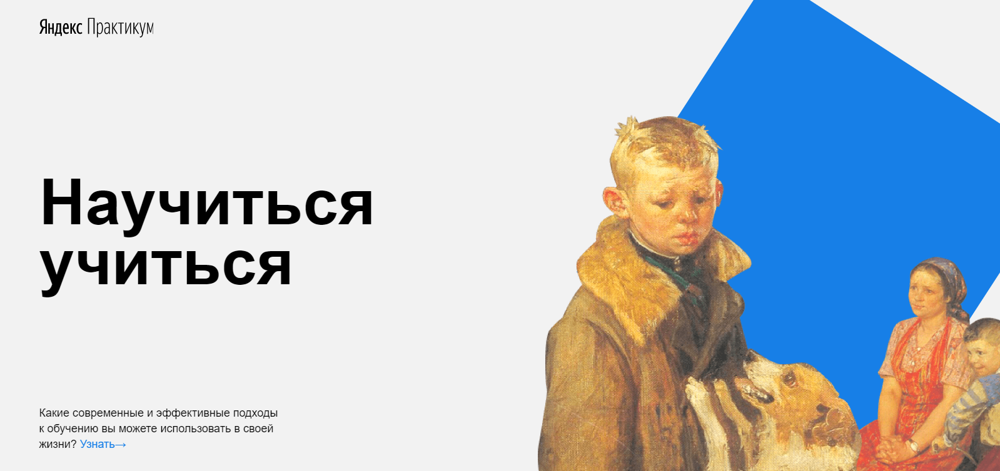

##Project work N1 on the course "Advanced HTML and CSS"
###from [Yandex Practicum. Web developer.](https://practicum.yandex.ru/profile/web)
____
###Description
This is a static landing page for learning HTML and CSS.
It was checked according to the BEM methodology with the file structure of nested
###Technologies
- Flexible drawer
- Positioning elements
- Animation and transformation using CSS
- Iframe
- BEM methodology
- File structure and file paths (nested BEM)
- The bastard
###Stack
- HTML
- CSS

###Future plan
- Adaptability
###Preview

____
Russian: [Ru](README.md)
