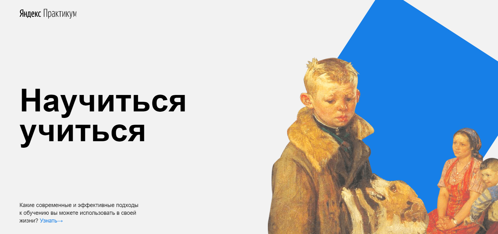

##Проектная работа №1 по курсу "Расширенные возможности HTML и CSS"
###от [Яндекс Практикум. Веб-разработчик.](https://practicum.yandex.ru/profile/web/)
____
###Описание
Это статичный лендинг для изучения HTML и CSS.
Был сверстан по методологии БЭМ с файловой структурой Nested
###Технологии
- Flexbox
- Positioning Elements
- Animation and Transform using CSS
- Iframe
- BEM Methodology
- File Structure and File Paths (Nested BEM)
- Git
###Стэк
- HTML
- CSS

###План по доработке
- Адаптивность
###Ссылка на сайт:
[Проектная работа на GitHub Pages]()
###Preview

____
English language: [En](README.en.md)
